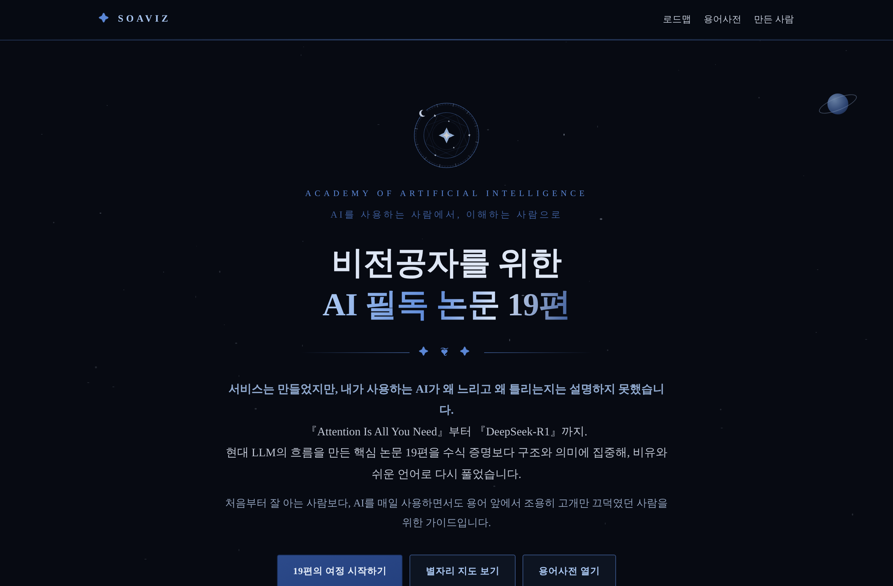

# 비전공자를 위한 AI 필독 논문 19편

> AI를 사용하는 사람에서, 이해하는 사람으로.

**바로 읽기 → https://readings-lovat.vercel.app/guide**

『Attention Is All You Need』(2017)부터 『DeepSeek-R1』(2025)까지, 현대 LLM의 흐름을 만든 핵심 논문 19편을 수식 증명보다 구조와 의미에 집중해 비유와 쉬운 언어로 풀어낸 학습 아카이브입니다.

매일 Claude Code·Codex·Vercel·Supabase로 만들지만 그 안이 어떻게 돌아가는지는 설명하지 못했던 바이브 코더가, 엔지니어와 같은 언어로 소통하기 위해 직접 공부하며 정리했습니다.

## 구성

| 섹션 | 내용 |
|---|---|
| 주차별 학습 로드맵 | 2013 word2vec → 2025 DeepSeek-R1, 발표 순서와 개념 의존관계로 배치한 19편 |
| 논문 구조도 | 논문마다 직접 그린 SVG 다이어그램 |
| 별자리 탐색 지도 | 19편을 밤하늘 별자리로 배치 — 별을 누르면 해당 논문으로 이동 |
| 용어사전 164개 | 난이도 별점(★~★★★★★), 핵심 개념 24개 형광 표시, 검색·필터 |

전부 단일 HTML 한 장(`index.html`)입니다. 클론해서 브라우저로 열면 그대로 동작합니다.

## 만든 사람

**이은교 · SOAVIZ** — AI 아티스트 · 프로덕트 빌더 · 콘텐츠 크리에이터
홍익대학교 대학원 AI·실감미디어콘텐츠학 석사과정 3차수. 컴퓨터공학 비전공자로서 이론의 빈칸을 채우기 위해 컴퓨터공학과 박사과정 수준의 '인공지능 특강'을 수강하며 정리한 학습 아카이브입니다.

[LinkedIn](https://www.linkedin.com/in/soaviz/) · [YouTube](https://www.youtube.com/@soavizai) · leeeunkyo@gmail.com

## 라이선스·고지

- 이 페이지의 해설·비유·용어 풀이는 모두 원문을 공부하며 직접 작성한 오리지널 콘텐츠이며, 논문 본문의 번역은 포함하지 않습니다. 각 논문의 저작권은 원저자에게 있으며 원문은 각 카드의 arXiv 링크에서 확인할 수 있습니다.
- Guide text © 2026 이은교 (SOAVIZ) · [CC BY-NC 4.0](https://creativecommons.org/licenses/by-nc/4.0/deed.ko) — 자세한 내용은 [LICENSE.md](LICENSE.md)
- 학습 노트 특성상 오류가 있을 수 있습니다. 지적은 Issues로 언제든 환영합니다.
